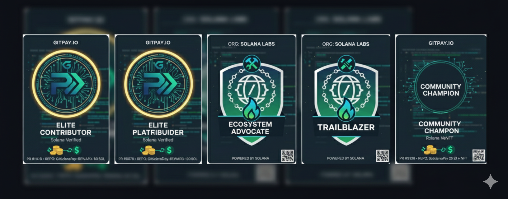

# 👋 Hi, I'm Ujesh Kumar Yadav 🚀  

💡 **AI/ML Engineer | Innovator | Problem Solver | Competitive Programmer**  
🏆 Hackathon Winner | GOOGLE solution challenge 2024 finalist | ICPC ‘24 Prelims Qualified  

---

  

---

## 🌐 Connect with me:
 
 
  

---

## 💻 Tech Stack

 
) 
 
 
 
 
 
 
  

 
 
 
 
 
 
  

 
 
 
 
 
 
  

 
 
 
 
 
  

 
 
  

---

## 🏅 Achievements:
- 🏆 **2x Hackathon Winner** (incl. 3x national level finalist and Qualified GOOGLE solution challenge 2024)  
- 🎯 **ICPC 2024 Amritapuri Online Prelims Qualified**  
- 💡 Machine learning Projects with **Microsoft, SAP, AICTE (Edunet)**  
- 🌍 Built & deployed **[LoklBiz](https://www.loklbiz.com/)** (live E-commerce startup project)  
- 📌 Organized **AI/ML Events & Competitions** at college  ( CODE CLUB TECHNICAL LEAD)
- 📊 Built multiple **AI/ML, AR/VR, Blockchain & Startup Projects** across domains  
- 🌟 **Hacktoberfest 2025 Contributor** (Badge ID: `cmgdjgm9u001cjl04ne877t6g`, Earned on Oct 5, 2025)

---

## 📈 GitHub Stats:

  
  
  

